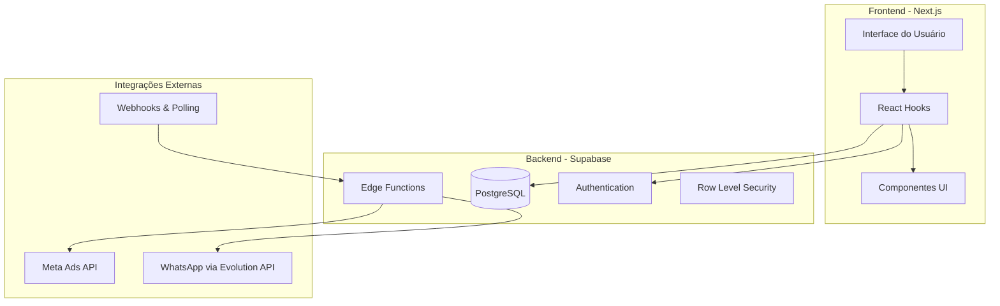
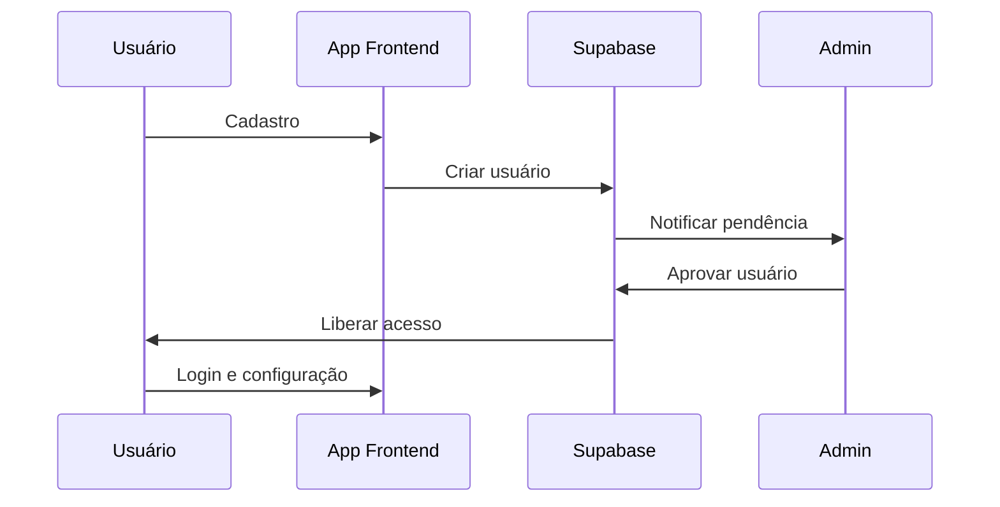
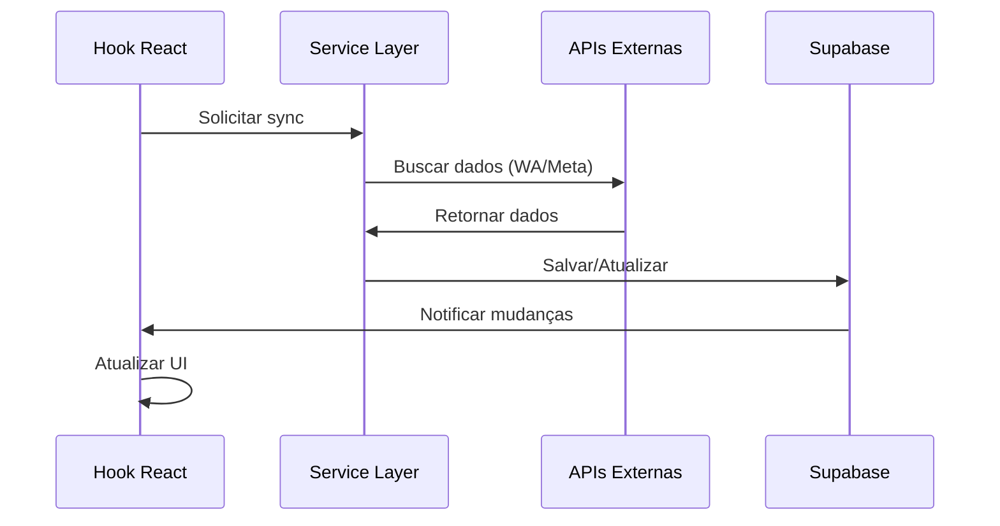

# 🚀 LiveShop Analytics - Documentação Completa 2025

## 🎯 Visão Geral do Projeto

**LiveShop Analytics** é uma plataforma completa de análise e otimização para lives de vendas, integrando dados de múltiplas fontes (WhatsApp Business, Meta Ads, Analytics própria) em um dashboard unificado para maximizar conversões e ROI de campanhas digitais.

## 🏗️ Arquitetura do Sistema

### Stack Tecnológico Principal

```yaml
Frontend:
  - Next.js 14 (App Router)
  - TypeScript
  - Tailwind CSS
  - React Hooks personalizados

Backend:
  - Supabase (PostgreSQL + Auth + Edge Functions)
  - Row Level Security (RLS)
  - Real-time subscriptions

Integrações:
  - Evolution API (WhatsApp Business)
  - Facebook Marketing API v18.0 (Meta Ads)
  - Webhooks e polling systems

Infraestrutura:
  - Vercel (Deploy recomendado)
  - CDN integrado
  - Serverless functions
```

### Diagrama de Arquitetura



## 🔧 Principais Funcionalidades

### 1. Sistema de Autenticação e Usuários

- **Login/Cadastro**: Interface completa com Supabase Auth
- **Perfis de usuário**: Dados pessoais, empresariais e configurações
- **Sistema de aprovação**: Admin pode aprovar/rejeitar novos usuários
- **Roles e permissões**: Controle granular de acesso

### 2. Dashboard Analytics

- **Métricas unificadas**: Dados de múltiplas fontes em uma visão
- **Cards interativos**: KPIs principais com drill-down
- **Filtros avançados**: Período, campanhas, grupos, status
- **Gráficos responsivos**: Visualização rica de dados temporais

### 3. Integração WhatsApp Business

#### Funcionalidades Core
- **Conexão via QR Code**: Interface simples e intuitiva
- **Multi-instância**: Suporte a múltiplas contas WhatsApp
- **Sincronização automática**: Grupos, contatos e métricas
- **Status em tempo real**: Polling contínuo do estado da conexão

#### Analytics WhatsApp
- **Grupos ativos**: Monitoramento de engagement
- **Participantes**: Análise de audiência e crescimento
- **Horários de pico**: Otimização de timing das mensagens
- **Taxa de resposta**: Métricas de conversão

### 4. Integração Meta Ads (Facebook/Instagram)

#### Funcionalidades Core
- **Token-based auth**: Autenticação via Facebook Developer
- **Multi-conta**: Suporte a múltiplas contas de anúncios
- **Sincronização completa**: Campanhas, Ad Sets, Ads e Insights
- **Rate limiting**: Respeita limites da API Meta

#### Dados Coletados
- **Campanhas**: Nome, status, objetivo, budget
- **Segmentação**: Idade, gênero, interesses, localização
- **Criativos**: Imagens, vídeos, textos, links
- **Métricas**: Impressões, cliques, conversões, custos

#### Analytics Meta Ads
- **ROI/ROAS**: Retorno sobre investimento publicitário
- **CPL/CPC**: Custo por lead e por clique
- **CTR**: Taxa de clique
- **Análise temporal**: Performance ao longo do tempo

### 5. Calculadora de Campanhas

- **Simulações de ROI**: Projeções baseadas em dados históricos
- **Comparativo de canais**: WhatsApp vs Meta Ads
- **Otimização de budget**: Sugestões de distribuição
- **Salvamento de cenários**: Histórico de cálculos

### 6. Vendas por Público

- **Segmentação avançada**: Cruzamento de dados WA + Meta
- **Análise de conversão**: Funil completo de vendas
- **Lifetime Value**: Valor do cliente ao longo do tempo
- **Audiência lookalike**: Identificação de públicos similares

## 📊 Estrutura do Banco de Dados

### Tabelas Principais

#### Usuários e Autenticação
```sql
auth.users                    -- Supabase Auth
profiles                      -- Dados complementares dos usuários
user_approvals                -- Sistema de aprovação
```

#### WhatsApp Business
```sql
whatsapp_instances           -- Instâncias conectadas
whatsapp_groups              -- Grupos sincronizados
whatsapp_contacts            -- Contatos dos grupos
whatsapp_logs               -- Logs de atividades
```

#### Meta Ads
```sql
meta_ad_accounts            -- Contas Meta conectadas
meta_campaigns              -- Campanhas publicitárias
meta_ad_sets                -- Conjuntos de anúncios
meta_ads                    -- Anúncios individuais
meta_insights               -- Métricas e resultados
meta_sync_logs              -- Logs de sincronização
```

#### Analytics e Dados
```sql
lives                       -- Lives realizadas
vendas                      -- Vendas registradas
pesquisa                    -- Dados de pesquisas (JSON)
enderecos                   -- Endereços de entrega
calculadora_dados           -- Cenários salvos
```

### Segurança - Row Level Security (RLS)

```sql
-- Exemplo: Usuários só acessam seus próprios dados
CREATE POLICY "user_data_isolation" ON meta_campaigns
    FOR ALL USING (auth.uid() = user_id);

-- Políticas aplicadas em todas as tabelas sensíveis
```

## 🛠️ Desenvolvimento e Deploy

### Setup Local

```bash
# 1. Clone do repositório
git clone <repository-url>
cd liveshop-analytics

# 2. Instalação de dependências
npm install

# 3. Configuração de ambiente
cp .env.example .env.local
# Editar com credenciais Supabase, Evolution API, etc.

# 4. Setup do banco (aplicar schema SQL)
# Via Supabase Dashboard ou CLI

# 5. Desenvolvimento
npm run dev
```

### Variáveis de Ambiente

```env
# Supabase
NEXT_PUBLIC_SUPABASE_URL=your-supabase-url
NEXT_PUBLIC_SUPABASE_ANON_KEY=your-supabase-anon-key

# Evolution API (WhatsApp)
VITE_EVOLUTION_API_URL=your-evolution-api-url
VITE_EVOLUTION_API_KEY=your-evolution-api-key

# Configurações gerais
VITE_DEMO_MODE=false
NEXT_PUBLIC_APP_ENV=development
```

### Deploy Produção

#### Vercel (Recomendado)
```bash
npm install -g vercel
vercel --prod
```

#### Manual
```bash
npm run build
npm start
```

## 🔄 Fluxos de Trabalho

### Fluxo de Onboarding do Usuário



### Fluxo de Sincronização de Dados



## 📈 Métricas e KPIs

### Métricas de Negócio
- **Revenue Total**: Receita das lives/campanhas
- **ROI/ROAS**: Retorno sobre investimento
- **CAC**: Custo de aquisição de cliente  
- **LTV**: Lifetime value do cliente
- **Conversion Rate**: Taxa de conversão geral

### Métricas Técnicas
- **Response Time**: Tempo de resposta das APIs
- **Uptime**: Disponibilidade do sistema
- **Sync Success Rate**: Taxa de sucesso das sincronizações
- **Error Rate**: Frequência de erros

### Métricas WhatsApp
- **Group Growth**: Crescimento de grupos
- **Engagement Rate**: Taxa de engajamento
- **Response Time**: Tempo médio de resposta
- **Active Hours**: Horários de maior atividade

### Métricas Meta Ads
- **Impressions**: Impressões totais
- **CTR**: Click-through rate
- **CPC/CPL**: Custos por clique/lead
- **Frequency**: Frequência de exibição

## 🚨 Monitoramento e Alertas

### Sistema de Logs
- **Application Logs**: Logs da aplicação Next.js
- **Sync Logs**: Logs das sincronizações (WhatsApp/Meta)
- **Error Logs**: Logs de erros e exceções
- **User Activity**: Logs de atividade dos usuários

### Alertas Configuráveis
- **API Down**: WhatsApp ou Meta indisponíveis
- **Sync Failures**: Falhas repetidas de sincronização
- **High Error Rate**: Taxa alta de erros
- **Performance Issues**: Degradação de performance

## 🔐 Segurança e Compliance

### Segurança de Dados
- **RLS (Row Level Security)**: Isolamento por usuário
- **Encryption**: Tokens e dados sensíveis criptografados
- **Rate Limiting**: Proteção contra abuso de APIs
- **Input Validation**: Sanitização de entradas

### Compliance
- **LGPD**: Tratamento adequado de dados pessoais
- **WhatsApp ToS**: Conformidade com termos WhatsApp
- **Meta Policies**: Aderência às políticas Meta Ads
- **Data Retention**: Políticas de retenção de dados

## 🔄 Roadmap Futuro

### Curto Prazo (Q1 2025)
- [ ] Sistema de notificações push
- [ ] Exportação de relatórios (PDF/Excel)
- [ ] Dashboard mobile otimizado
- [ ] Integração com Google Analytics

### Médio Prazo (Q2-Q3 2025)
- [ ] IA para análise de criativos
- [ ] Automação de campanhas
- [ ] Sistema de A/B testing
- [ ] Marketplace de templates

### Longo Prazo (Q4 2025+)
- [ ] Integração com TikTok Ads
- [ ] Sistema de afiliados
- [ ] White-label solution
- [ ] API pública para terceiros

## 📚 Documentação Técnica

### Documentos Específicos
- **[META_ADS_INTEGRATION.md](./META_ADS_INTEGRATION.md)**: Integração Meta Ads
- **[WHATSAPP_INTEGRATION.md](./WHATSAPP_INTEGRATION.md)**: Integração WhatsApp
- **[IMPLEMENTATION.md](../IMPLEMENTATION.md)**: Detalhes técnicos da implementação

### APIs e Referências
- **Evolution API**: Documentação WhatsApp Business
- **Facebook Marketing API**: Documentação Meta Ads
- **Supabase**: Documentação do backend
- **Next.js**: Framework frontend

## 💡 Contribuição e Desenvolvimento

### Guidelines
1. **TypeScript**: Código 100% tipado
2. **Clean Code**: Seguir princípios de código limpo
3. **Component Pattern**: Componentes reutilizáveis
4. **Hook Pattern**: Lógica em hooks customizados
5. **Documentation**: Documentar novas funcionalidades

### Testing
```bash
# Unit tests
npm run test

# E2E tests  
npm run test:e2e

# Type checking
npm run type-check
```

---

**Status do Projeto**: 🟢 **Ativo e em Desenvolvimento**  
**Última Atualização**: Janeiro 2025  
**Versão**: 2.0 (Com Meta Ads Integration)  
**Responsável**: Equipe LiveShop Analytics