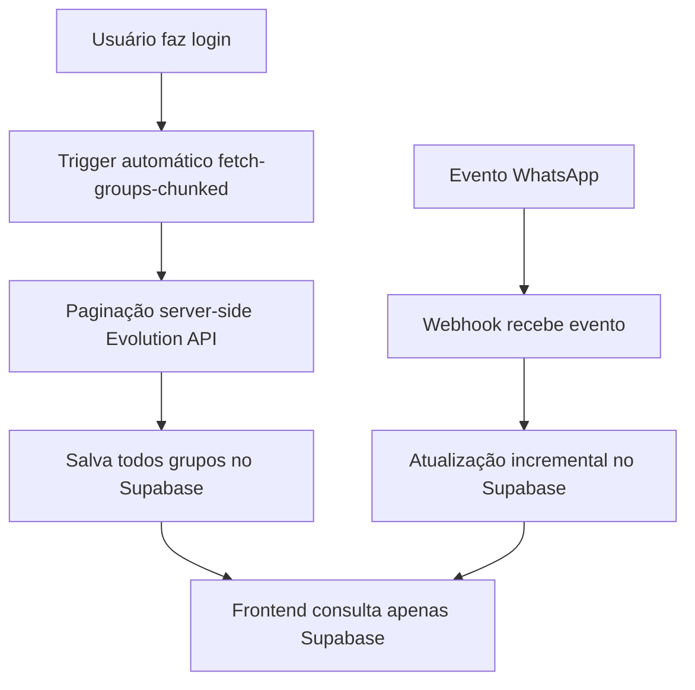
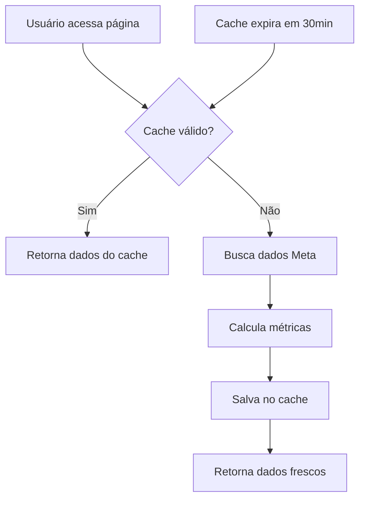

# 📱 Integração WhatsApp Business - LiveShop Analytics

## 🎯 Visão Geral

A integração WhatsApp Business permite conectar contas do WhatsApp Business API através da Evolution API, proporcionando análises de conversas, grupos e métricas de engajamento para otimização de campanhas de vendas.

## 🔧 Arquitetura Técnica

### Componentes Principais

```typescript
src/hooks/useWhatsAppConnection.tsx    // Hook React para conexão
src/components/QRCodeDisplay.tsx       // Interface de QR Code
src/services/whatsappService.ts        // Cliente Evolution API
```

### Fluxo de Conexão

```mermaid
graph TD
    A[Usuário clica "Conectar"] → B[Gerar QR Code]
    B → C[Usuário escaneia WhatsApp]
    C → D[Evolution API autentica]
    D → E[Status conectado]
    E → F[Sync grupos e contatos]
```

## 🚀 Como Usar

### 1. Conectar WhatsApp

1. Acesse página "Integrações"
2. Clique "Conectar WhatsApp"
3. Escaneie QR Code com WhatsApp Business
4. Aguarde confirmação de conexão

### 2. Sincronização Automática

```typescript
// Hook gerencia estado automaticamente
const {
  currentInstance,     // Instância ativa
  connectionState,     // Status da conexão
  qrCode,             // QR Code para escaneio
  isLoading,          // Estado de carregamento
  isSyncing,          // Sincronização ativa
  error,              // Mensagens de erro
  connect,            // Conectar nova instância
  disconnect,         // Desconectar
  generateQR,         // Gerar novo QR
  refreshInstances    // Atualizar dados
} = useWhatsAppConnection();
```

### 3. Gerenciamento de Grupos

- Sincronização automática de grupos
- Métricas de engajamento
- Análise de participantes
- Histórico de atividades

## 📊 Dados Coletados

### Instâncias
- Nome da instância
- Número do telefone
- Status de conexão
- Última sincronização

### Grupos WhatsApp
- Nome e descrição do grupo
- Número de participantes
- Administradores
- Data de criação

### Métricas de Engajamento
- Mensagens enviadas/recebidas
- Taxa de resposta
- Horários de maior atividade
- Análise de participantes ativos

### Logs de Atividade
- Conexões/desconexões
- Alterações em grupos
- Eventos de sincronização
- Erros e recuperação

## 🔐 Configuração Evolution API

### Variáveis de Ambiente

```env
# Configuração Evolution API
VITE_EVOLUTION_API_URL=https://your-evolution-api.com
VITE_EVOLUTION_API_KEY=your-api-key
VITE_EVOLUTION_INSTANCE_NAME=liveshop-instance
```

### Endpoints Utilizados

```typescript
// Criar instância
POST /instance/create

// Conectar via QR Code
GET /instance/connect/{instanceName}

// Status da conexão
GET /instance/connectionState/{instanceName}

// Buscar grupos
GET /group/fetchAllGroups/{instanceName}

// Logout/Desconectar
DELETE /instance/logout/{instanceName}
```

## 🛠️ Componentes de Interface

### QRCodeDisplay

```typescript
interface QRCodeDisplayProps {
  qrCode?: string;
  status: 'generating' | 'active' | 'connected' | 'error';
  countdown?: number;
  attempts?: number;
  maxAttempts?: number;
  isLoading?: boolean;
  error?: string;
  onRefresh: () => void;
  onCancel: () => void;
}
```

### Estados de Conexão

- **`disconnected`**: Desconectado, pode conectar
- **`connecting`**: Iniciando processo de conexão
- **`pending-qr`**: QR Code gerado, aguardando escaneio
- **`connected`**: Conectado e funcionando
- **`error`**: Erro na conexão ou operação

## 🔄 Sincronização e Polling

### Sistema de Polling

```typescript
// Verificação automática a cada 5 segundos
useEffect(() => {
  const interval = setInterval(checkConnectionStatus, 5000);
  return () => clearInterval(interval);
}, []);
```

### Pré-carregamento de Grupos

```typescript
// Busca grupos em background após conexão
const preloadGroups = async () => {
  const response = await fetch('/functions/v1/whatsapp-fetch-groups', {
    method: 'POST',
    headers: {
      'Authorization': `Bearer ${token}`,
      'Content-Type': 'application/json'
    },
    body: JSON.stringify({
      instanceName: instance.name,
      userId: user.id
    })
  });
};
```

## 🚨 Tratamento de Erros

### Cenários Comuns

1. **QR Code Expirado**
   ```typescript
   // Auto-refresh após 50 segundos
   useEffect(() => {
     const timer = setTimeout(() => {
       if (connectionState === 'pending-qr') {
         generateQR();
       }
     }, 50000);
   }, [qrCode]);
   ```

2. **Conexão Perdida**
   ```typescript
   // Tentativa automática de reconexão
   if (connectionState === 'error') {
     setTimeout(() => {
       connect();
     }, 5000);
   }
   ```

3. **Rate Limiting**
   ```typescript
   // Implementação de throttling
   const rateLimiter = {
     attempts: 0,
     maxAttempts: 3,
     backoff: 1000
   };
   ```

## 📈 Analytics WhatsApp

### Métricas Principais

- **Grupos Ativos**: Número de grupos sincronizados
- **Participantes**: Total de contatos alcançados  
- **Taxa de Engajamento**: Interação por grupo
- **Horários de Pico**: Análise temporal

### Integração com Meta Ads

```typescript
// Correlação entre campanhas Meta e grupos WhatsApp
const correlateMetaWithWhatsApp = (metaCampaigns, whatsappGroups) => {
  return metaCampaigns.map(campaign => ({
    ...campaign,
    relatedGroups: findRelatedGroups(campaign, whatsappGroups),
    conversionRate: calculateConversion(campaign, whatsappGroups)
  }));
};
```

## 🔧 Configurações Avançadas

### WhatsAppAdvancedSettingsWrapper

```typescript
// Componente para configurações futuras
<WhatsAppAdvancedSettingsWrapper 
  currentInstance={currentInstance}
  onSettingsChange={handleSettingsUpdate}
/>
```

### Modo Demo

```typescript
// Para desenvolvimento sem WhatsApp real
if (DEMO_MODE) {
  return {
    currentInstance: demoInstance,
    connectionState: 'connected',
    qrCode: null,
    // ... dados mockados
  };
}
```

## 🚀 Sistema de Cache Otimizado

### Fluxo de Sincronização Automática



### Vantagens do Sistema de Cache

1. **Performance**: Frontend consulta apenas tabela local (Supabase)
2. **Confiabilidade**: Sem timeout da Evolution API
3. **Atualização Incremental**: Webhook mantém dados atualizados
4. **Experiência do Usuário**: Busca instantânea de grupos

### Implementação Frontend

```typescript
// Hook para buscar grupos do cache
const { fetchWhatsAppGroups, hasWhatsAppGroups } = useWhatsAppGroups();

// Busca instantânea no Supabase
const groups = await fetchWhatsAppGroups(userId, searchTerm);

// Verificação de sincronização
const isSynced = await hasWhatsAppGroups(userId);
```

### Estados de Sincronização

- **🔄 Sincronizando**: Grupos sendo buscados em background
- **⚠️ Não sincronizado**: Aguardando primeira sincronização
- **✅ Sincronizado**: Dados disponíveis para busca

## 📊 Sistema de Cache para Dados Meta

### Cache de Métricas Calculadas

O sistema agora implementa cache inteligente para dados Meta nas páginas de análise:



### Implementação na Tela Details

```typescript
// Verificação de cache válido
const cacheResult = await fetchLiveWithCache(liveId);

if (cacheResult.fromCache && cacheResult.data.cached_metrics) {
  // Usar dados do cache (instantâneo)
  setMetricsV2(cacheResult.data.cached_metrics);
  setExtractedDataV2(cacheResult.data.cached_group_data);
} else {
  // Buscar dados frescos e calcular métricas
  const completeData = await fetchCompleteLiveData(liveId);
  await calculateAndCacheMetrics(completeData);
}
```

### Colunas de Cache na Tabela `lives`

```sql
-- Cache de métricas calculadas
cached_metrics JSONB,           -- CPL Líquido, CPL Meta, Taxa de Retenção
cached_group_data JSONB,        -- Dados de grupos WhatsApp
cached_meta_data JSONB,         -- Dados Meta (campanhas, gastos, leads)
last_synced_at TIMESTAMP,       -- Timestamp da última sincronização
```

### Benefícios do Cache Meta

1. **Performance**: Evita recálculos desnecessários
2. **Experiência**: Carregamento instantâneo de dados válidos
3. **Eficiência**: Reduz chamadas à Meta API
4. **Confiabilidade**: Fallback para dados em cache se API falhar

## 🚀 Edge Functions Supabase

### fetch-groups-chunked (Nova Implementação)

```typescript
// Edge Function otimizada com paginação server-side
export default async function handler(req: Request) {
  const { instanceName, userId, searchTerm } = await req.json();
  
  // Paginação automática para evitar timeout
  const CHUNK_SIZE = 50;
  const MAX_PAGES = 20;
  
  let allGroups = [];
  let currentPage = 1;
  let hasMorePages = true;
  
  while (hasMorePages && currentPage <= MAX_PAGES) {
    const response = await fetch(
      `${evolutionUrl}/group/fetchAllGroups/${instanceName}?page=${currentPage}&limit=${CHUNK_SIZE}`
    );
    
    const pageGroups = await response.json();
    allGroups = [...allGroups, ...pageGroups];
    
    hasMorePages = pageGroups.length === CHUNK_SIZE;
    currentPage++;
  }
  
  // Salvar todos os grupos no Supabase
  await supabase.from('whatsapp_groups').upsert(
    allGroups.map(group => ({
      group_id: group.id,
      group_name: group.subject,
      user_id: userId,
      group_size: group.size,
      group_owner: group.owner,
      group_created_at: group.creation,
      participant_count: group.size,
      updated_at: new Date().toISOString()
    })),
    { onConflict: 'group_id,user_id' }
  );
  
  return new Response(JSON.stringify(allGroups));
}
```

### whatsapp-webhook (Atualização Incremental)

```typescript
// Webhook para atualização incremental de grupos
export default async function handler(req: Request) {
  const { event, data } = await req.json();
  
  if (event === 'group-participants.update') {
    const { id: group_id, participants, action } = data;
    
    // Buscar informações atualizadas do grupo
    const groupInfo = await fetchGroupInfoFromEvolutionAPI(group_id);
    
    // Atualizar cache no Supabase
    await supabase.from('whatsapp_groups').upsert({
      group_id,
      group_name: groupInfo.subject,
      participant_count: groupInfo.size,
      updated_at: new Date().toISOString()
    }, { onConflict: 'group_id,user_id' });
    
    // Log do evento de participante
    await supabase.from('whatsapp_groups_log').insert({
      id_grupo: group_id,
      group_name: groupInfo.subject,
      whatsapp_phone_id: participants[0],
      event: action === 'add' ? 'join' : 'leave',
      user_id: userId
    });
  }
}
```

## 📋 Tabelas Supabase

### whatsapp_instances
```sql
CREATE TABLE whatsapp_instances (
  id UUID PRIMARY KEY DEFAULT gen_random_uuid(),
  user_id UUID REFERENCES auth.users(id),
  instance_name TEXT NOT NULL,
  phone_number TEXT,
  connection_state TEXT DEFAULT 'disconnected',
  created_at TIMESTAMP DEFAULT NOW()
);
```

### whatsapp_groups
```sql
CREATE TABLE whatsapp_groups (
  id UUID PRIMARY KEY DEFAULT gen_random_uuid(),
  group_id TEXT NOT NULL,
  group_name TEXT NOT NULL,
  user_id UUID NOT NULL REFERENCES auth.users(id),
  created_at TIMESTAMP WITH TIME ZONE DEFAULT NOW(),
  updated_at TIMESTAMP WITH TIME ZONE DEFAULT NOW(),
  monitoring BOOLEAN DEFAULT true,
  group_size INTEGER DEFAULT 0,
  group_owner TEXT,
  group_created_at TIMESTAMP WITH TIME ZONE,
  participant_count INTEGER,
  last_synced_at TIMESTAMP WITH TIME ZONE DEFAULT NOW(),
  UNIQUE(group_id, user_id)
);
```

## 🔄 Próximas Funcionalidades

### Planejadas
- [ ] Mensagens automáticas programadas
- [ ] Análise de sentimento em conversas
- [ ] Webhook para eventos em tempo real
- [ ] Dashboard específico WhatsApp
- [ ] Integração com CRM externo
- [ ] Backup automático de conversas

### Melhorias Técnicas
- [ ] Reconexão automática inteligente
- [ ] Cache de dados offline
- [ ] Compressão de imagens/mídia
- [ ] Análise de performance de mensagens

---

**Status**: ✅ Implementado e Funcional  
**Última Atualização**: Janeiro 2025  
**Responsável**: Sistema LiveShop Analytics