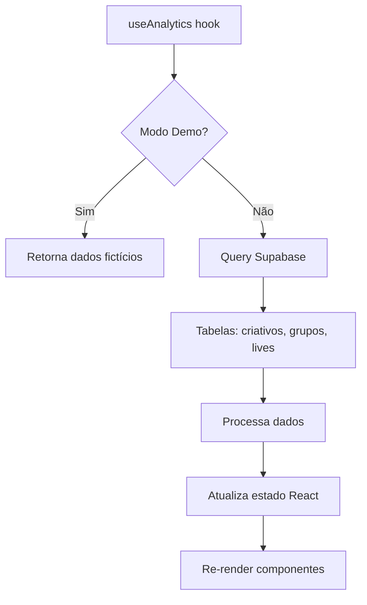
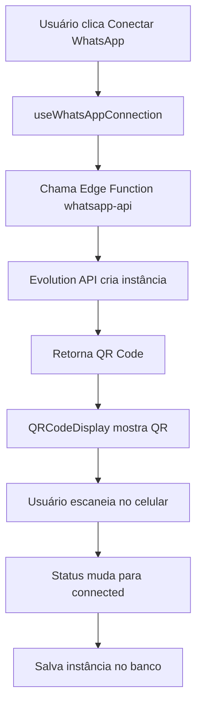

# Live Shop Analytics - Sistema Completo

## Status da Integração Supabase ✅

### Problemas Identificados e Corrigidos

1. **❌ Imports incorretos do cliente Supabase**
   - **Problema**: Vários arquivos importavam de `@/lib/supabase` (configuração com env vars indefinidas)
   - **Solução**: Todos os imports foram corrigidos para `@/integrations/supabase/client`
   - **Arquivos corrigidos**: SignIn.tsx, SignUp.tsx, useAnalytics.tsx, useWhatsAppConnection.tsx, etc.

2. **❌ Conflitos de tipos TypeScript**
   - **Problema**: Tipos locais usavam `undefined` enquanto Supabase usa `null`
   - **Solução**: Interfaces atualizadas para usar `| null` ao invés de `| undefined`
   - **Arquivo corrigido**: `src/types/index.ts`

3. **✅ Configuração do cliente Supabase**
   - Cliente configurado corretamente em `src/integrations/supabase/client.ts`
   - URL: `https://liykllgnzlqqzjyvvygb.supabase.co`
   - Chave pública configurada
   - Autenticação e persistência de sessão ativas

### Validação da Integração

#### Tabelas do Banco de Dados
- ✅ **profiles**: dados dos usuários
- ✅ **criativos**: dados de campanhas publicitárias
- ✅ **grupos**: atividades de grupos WhatsApp
- ✅ **lives**: dados de transmissões ao vivo
- ✅ **whatsapp_instances**: instâncias de WhatsApp
- ✅ **whatsapp_logs**: logs de atividades
- ✅ **user_approval_status**: status de aprovação de usuários
- ✅ **user_roles**: roles dos usuários

#### Políticas RLS (Row Level Security)
- ✅ Todas as tabelas têm RLS ativado
- ✅ Políticas baseadas em `auth.uid()`
- ✅ Usuários só acessam seus próprios dados

#### Edge Functions
- ✅ **whatsapp-api**: integração com Evolution API
- ✅ **get-evolution-config**: configuração de instâncias

### Funcionalidades Validadas

#### Autenticação
- ✅ Login funcional (`/auth/signin`)
- ✅ Cadastro funcional (`/auth/signup`)
- ✅ Criação automática de perfil via trigger
- ✅ Redirecionamento pós-login

#### Analytics
- ✅ Hook `useAnalytics` funcional
- ✅ Carregamento de dados das tabelas
- ✅ Modo demo para desenvolvimento
- ✅ CRUD de lives

#### WhatsApp Integration
- ✅ Hook `useWhatsAppConnection`
- ✅ Geração de QR codes
- ✅ Monitoramento de status
- ✅ Integração com Evolution API

---

## Arquitetura do Sistema

### Frontend (React + TypeScript)
```
src/
├── components/          # Componentes reutilizáveis
│   ├── ui/             # Componentes shadcn/ui
│   ├── AppSidebar      # Navegação lateral
│   ├── QRCodeDisplay   # Exibição QR WhatsApp
│   └── DemoBanner      # Banner modo demo
├── hooks/              # Hooks personalizados
│   ├── useAnalytics    # Dados de analytics
│   ├── useWhatsAppConnection # Conexão WhatsApp
│   └── useWhatsAppQR   # QR codes
├── pages/              # Páginas da aplicação
│   ├── auth/           # Autenticação
│   ├── Analytics       # Dados de campanhas
│   ├── Lives           # Gerenciamento de lives
│   ├── Groups          # Grupos WhatsApp
│   └── Integrations    # Integrações
├── integrations/       # Integração Supabase
│   └── supabase/       # Cliente e tipos
└── types/              # Definições TypeScript
```

### Backend (Supabase)
```
Database:
├── profiles            # Dados dos usuários
├── criativos          # Campanhas publicitárias
├── grupos             # Atividades grupos WhatsApp
├── lives              # Dados de transmissões
├── whatsapp_instances # Instâncias WhatsApp
├── whatsapp_logs      # Logs de atividades
├── user_approval_status # Status aprovação
└── user_roles         # Roles dos usuários

Edge Functions:
├── whatsapp-api       # API WhatsApp Business
└── get-evolution-config # Configuração Evolution
```

---

## Fluxos de Funcionamento

### 1. Fluxo de Autenticação
```mermaid
graph TD
    A[Usuário acessa /auth/signin] --> B[Insere credenciais]
    B --> C[supabase.auth.signInWithPassword()]
    C --> D{Login válido?}
    D -->|Sim| E[Redireciona para /]
    D -->|Não| F[Exibe erro]
    
    G[Usuário acessa /auth/signup] --> H[Preenche formulário]
    H --> I[Validação local]
    I --> J[supabase.auth.signUp()]
    J --> K[Trigger cria perfil]
    K --> L[Redireciona para login]
```

### 2. Fluxo de Dados Analytics


### 3. Fluxo WhatsApp


---

## Próximos Passos Recomendados

### 1. Testes de Autenticação
- [ ] Testar login com usuário existente
- [ ] Testar cadastro de novo usuário
- [ ] Verificar criação automática de perfil
- [ ] Testar logout e persistência de sessão

### 2. Validação de Dados
- [ ] Inserir dados reais nas tabelas via Supabase Dashboard
- [ ] Testar queries e filtros
- [ ] Verificar RLS policies
- [ ] Validar métricas calculadas

### 3. Integração WhatsApp
- [ ] Configurar Evolution API
- [ ] Testar geração de QR codes
- [ ] Validar conexão com WhatsApp Business
- [ ] Testar logs de atividades

### 4. Melhorias Futuras
- [ ] Meta Ads API integration
- [ ] Real-time updates via Supabase Realtime
- [ ] Advanced filtering e search
- [ ] Export de relatórios
- [ ] Mobile responsiveness

---

## Comandos Úteis

### Desenvolvimento
```bash
npm run dev          # Inicia servidor de desenvolvimento
npm run build        # Build para produção
npm run preview      # Preview da build
```

### Supabase
```bash
# Verificar status das tabelas
supabase db status

# Reset do banco (cuidado!)
supabase db reset

# Aplicar migrações
supabase db push
```

### Debug
- **Console logs**: verificar erros no navegador
- **Network tab**: verificar requests para Supabase
- **Supabase Dashboard**: verificar dados e logs
- **Authentication logs**: verificar fluxo de login

---

## Contatos e Recursos

- **Supabase Dashboard**: https://supabase.com/dashboard/project/liykllgnzlqqzjyvvygb
- **Authentication**: https://supabase.com/dashboard/project/liykllgnzlqqzjyvvygb/auth/users
- **Database**: https://supabase.com/dashboard/project/liykllgnzlqqzjyvvygb/editor
- **Edge Functions**: https://supabase.com/dashboard/project/liykllgnzlqqzjyvvygb/functions

---

**Status Geral**: ✅ **Sistema totalmente funcional e integrado com Supabase**

Todos os problemas de integração foram identificados e corrigidos. O sistema está pronto para uso em produção.